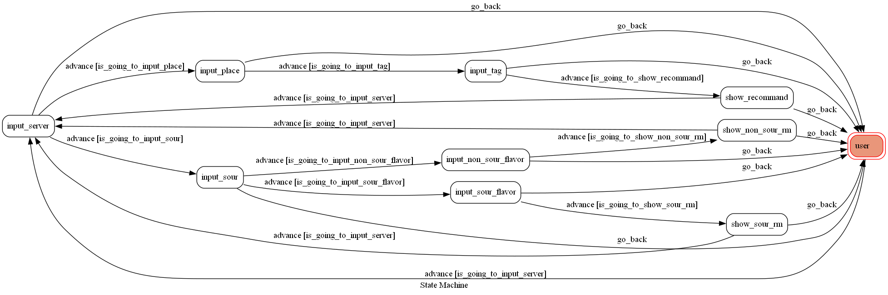
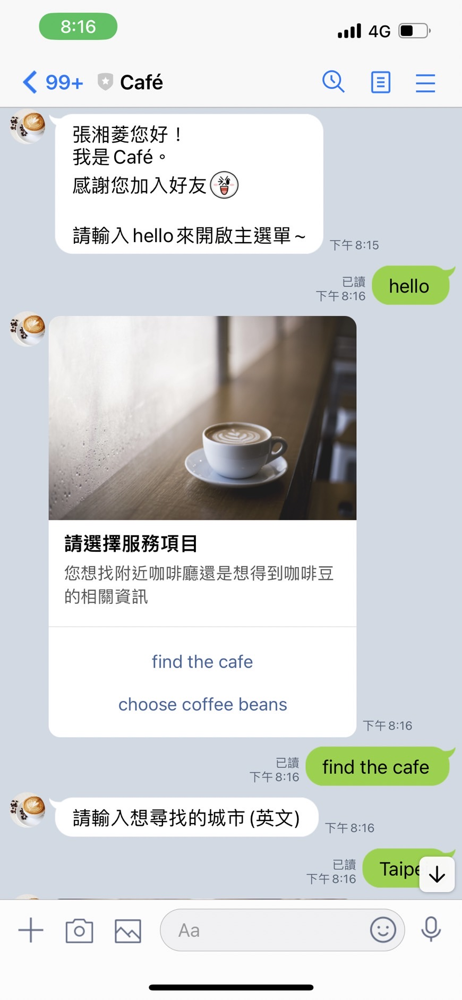
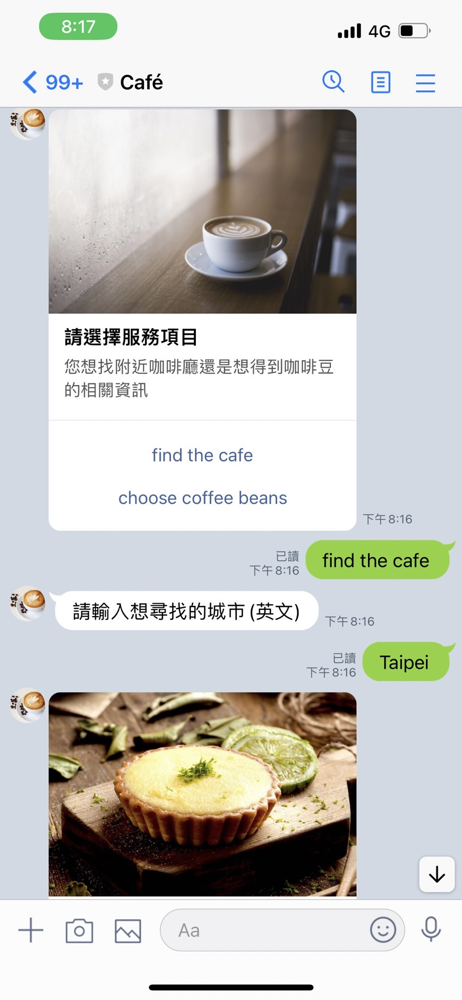
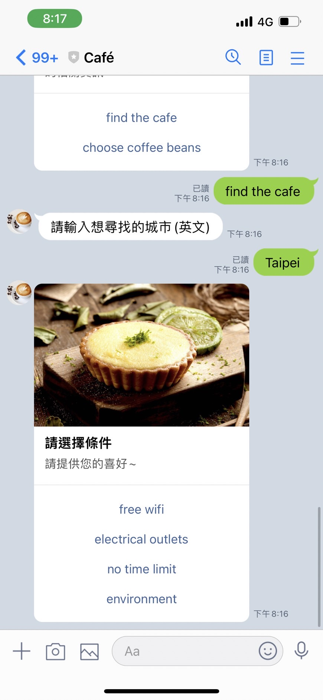
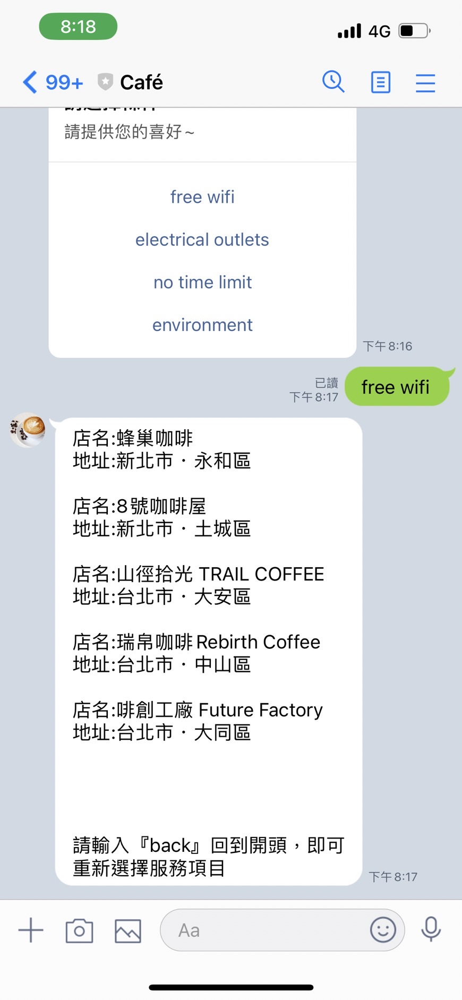
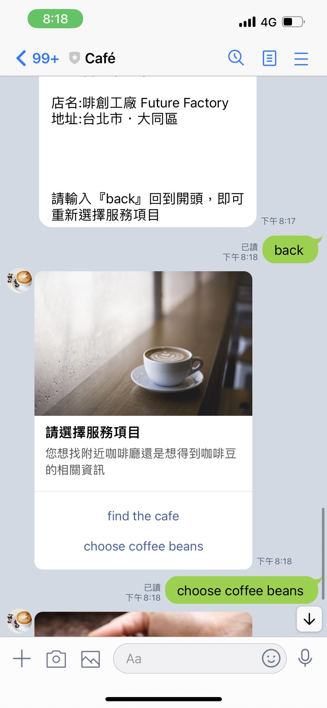
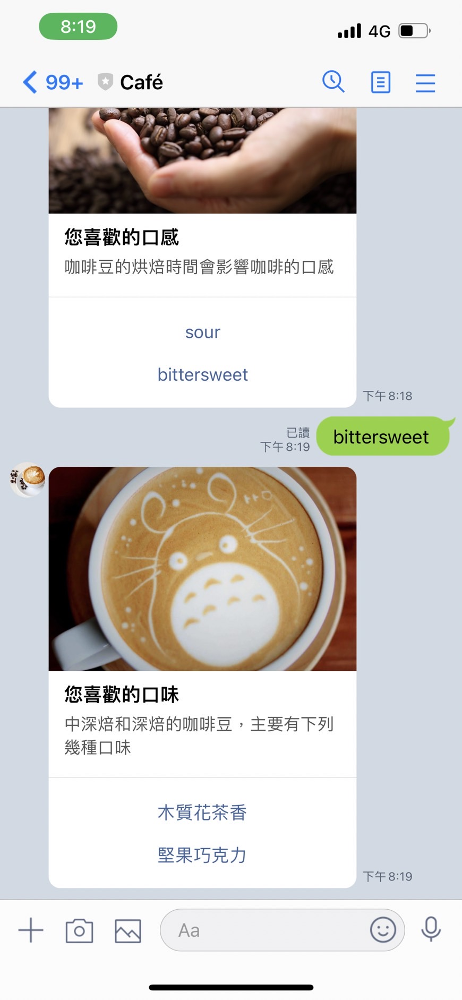
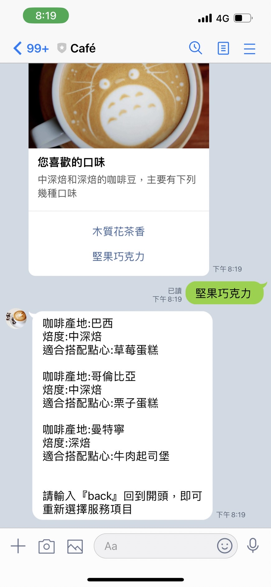
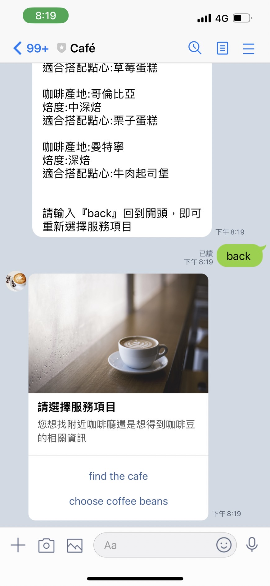

# Café line bot

## 前言
龐大的課業壓力下,泡在圖書館寫程式的樣子成為日常，常常一待就是一整天，我們如何在這匆匆流逝的時光內找到一絲愜意，在苦澀中嚐到甘甜。
Café Line Bot能為您找到合適的咖啡廳及咖啡豆，讓您在努力向前奔走的道路上，找到屬於您的充電站，在咖啡冷掉之前，享受抽離生活的美好。

## 構想
Café Line Bot提供兩種服務。
* 推薦咖啡廳: 您可輸入所在的城市及在意的條件(有無wifi、插頭等)，我們會依據您提供的條件，為您推薦五家咖啡廳，方便您選擇。
* 推薦咖啡豆(生產地): 手沖咖啡是許多咖啡愛好者所熟悉的，許多因素都會影響咖啡的風味，您可提供對咖啡口感的偏好，讓我們為您推薦適合的咖啡豆產地。

### 組成
* LINE Bot: Built by the official LINE Messaging API
* Web Scraping: Use BeutifulSoup to scrape websites to recommand Café
* Backend: Built the backend with Flask to handle the webhook
* FSM: Create FSMs with pytransitions for the users state managemen

### FSM


### Install Dependency
```sh
pip3 install pipenv

pipenv --three

pipenv install

pipenv shell
```

* pygraphviz (For visualizing Finite State Machine)
    * [Setup pygraphviz on Ubuntu](http://www.jianshu.com/p/a3da7ecc5303)
	* [Note: macOS Install error](https://github.com/pygraphviz/pygraphviz/issues/100)


### Secret Data
You should generate a `.env` file to set Environment Variables refer to our `.env.sample`.
`LINE_CHANNEL_SECRET` and `LINE_CHANNEL_ACCESS_TOKEN` **MUST** be set to proper values.
Otherwise, you might not be able to run your code.

### Run Locally
You can either setup https server or using `ngrok` as a proxy.

### Instruction
* 基本操作:
	* 指定大小寫皆可，但需輸入英文。
	* 隨時輸入`hello`、`back`即可回到開頭，重新選擇想要的服務。
* 架構:
	* 選擇想要的服務 -> `find the cafe`或`choose coffee beans`
	* 若選擇`find the cafe`:
		* 輸入城市 -> `英文`
		* 選擇條件 -> `free wifi`或`electrical outlets`或`no time limit`或`environment`
		* 推薦五間適合的咖啡廳
		* 輸入`back`回到開頭
	* 若選擇`choose coffee beans`:
		* 選擇喜歡的口感 -> `sour`或`bittersweet`
		* 選擇喜歡的風味 -> 依據前一個選擇給出兩種口味選項
		* 推薦適合的咖啡豆(生產地)與合適的烘焙度及搭配點心
		* 輸入`back`回到開頭

### Demo







